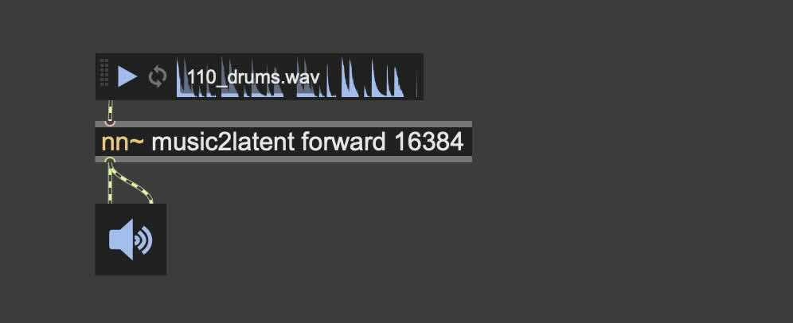

# Music2Latent-Scripted

Exporting [Music2Latent](https://github.com/SonyCSLParis/music2latent.git) to TorchScript for streamable continuous inference, to be used with [nn~](https://github.com/acids-ircam/nn_tilde.git) in MaxMSP/PureDara.  


https://github.com/user-attachments/assets/912aae55-618b-4e69-900c-c8c491dbef24


## How to export  

Please download the pre-trained Music2Latent model [here](https://huggingface.co/SonyCSLParis/music2latent)   
Open terminal, clone this repository and cd into the folder:   
```bash
git clone https://github.com/jasper-zheng/music2latent-scripted.git
cd music2latent-scripted
```
Run this to export to TorchScript:  
```bash
python music2latent/export.py --model path/to/music2latent.pt --out path/to/scripted-m2l.ts
```
#### Optional:  
If you have a music2latent model with customised `config.py`, add it with the `--config` keyword:  
```bash
python music2latent/export.py --model music2latent.pt --config config.py
```
Use `--device` to specify which device (`cpu/mps/cuda`) to test the inference when exporting.  
```bash
python music2latent/export.py --model music2latent.pt --device mps
```  
Use `--ratio` to specify the compression ratio from waveform to latents, at the time domain. This need to match your model setting.   
```bash
python music2latent/export.py --model music2latent.pt --ratio 4096
```  
Use `--test` to test the exported model on dummy samples.   
```bash
python music2latent/export.py --model music2latent.pt --device cuda --test
```   

## Important known issues  
When loading the scripted model in `nn~`:  
 - We recommend setting the buffer size in `nn~` to something above 8192. `8192` and `16384` are recommended. Buffer size can be set through the third argument in `nn~`:  
 - </img>
 - Once it's loaded and audio starts streaming, it takes ~10s to warm-up, and there'll be some loud noise in the first few seconds, be careful.  
 - When forward passing sounds that are more sustained, you may hear a constant pulse. This happens because we're not using causal convolution when exporting the model. We've put cached 2d convolution on our to-do list.  


## Latent space tricks  

### Latent space walk


https://github.com/user-attachments/assets/1db70fbe-af01-4f19-ba40-6e1e082c2e8d


### Latent space walk with latent terrain (2D Granular Synthesis)  

https://github.com/user-attachments/assets/81164bda-b2da-4844-8c55-f057656dad78

[Full Video](https://www.youtube.com/watch?v=98geiJ_P-uQ)


## To-do  
 - `export.py`   
 - Adapt to [2d cached-conv](https://github.com/jasper-zheng/cached_conv2d)  
 - smaller music2latent for light-weight inference  

## Acknowledgement  

Music2Latent:  
M. Pasini, S. Lattner, and G. Fazekas, “Music2Latent: Consistency Autoencoders for Latent Audio Compression”, in Proc. of the 25th Int. Society for Music Information Retrieval Conf., San Francisco, United States, 2024.  
Original repository: https://github.com/SonyCSLParis/music2latent/  

nn_tilde:  
https://github.com/acids-ircam/nn_tilde.git
